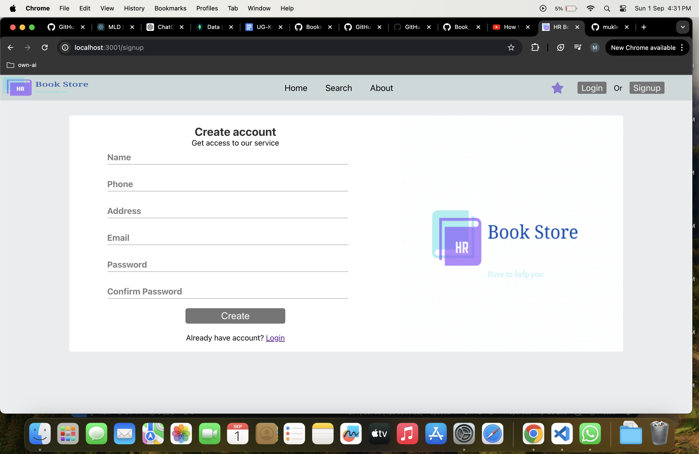
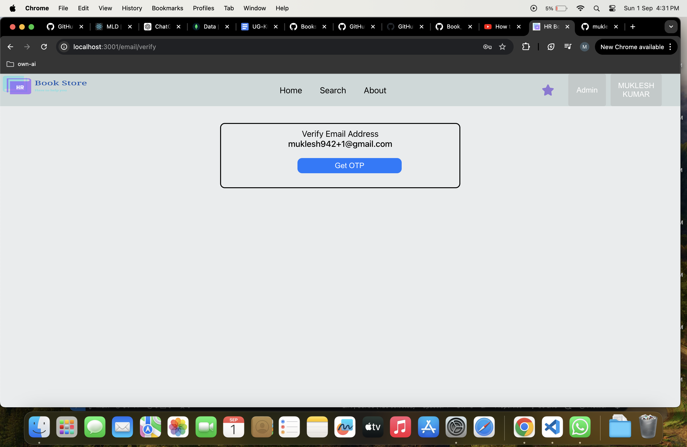
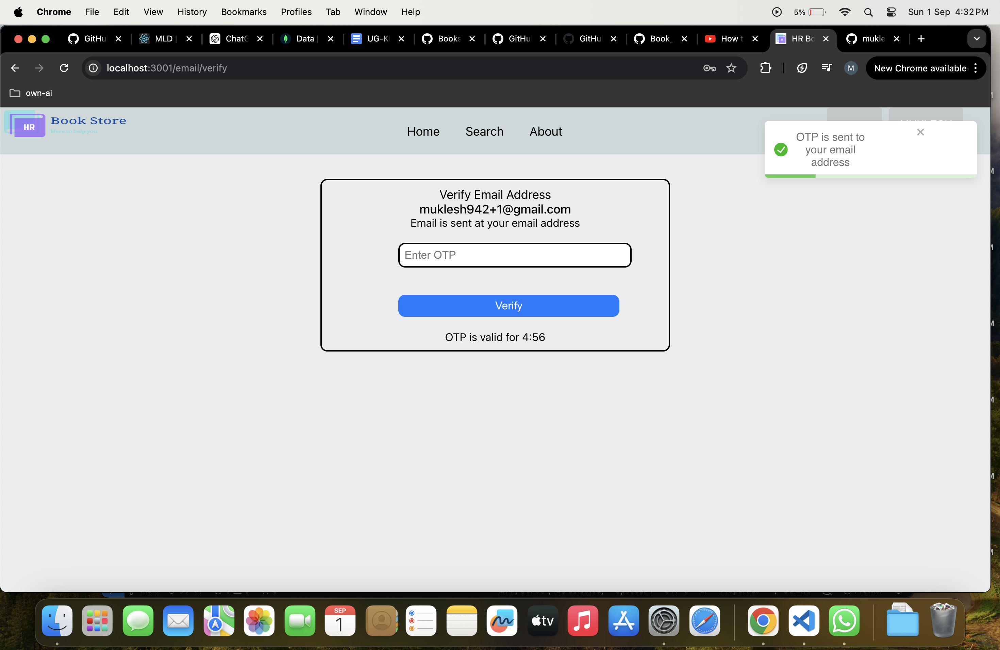
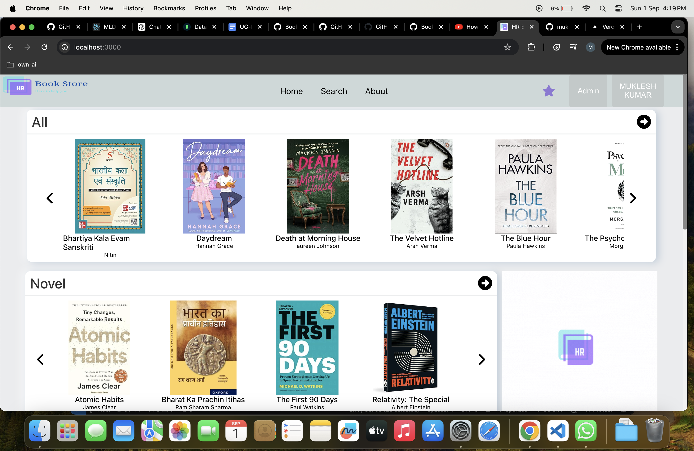
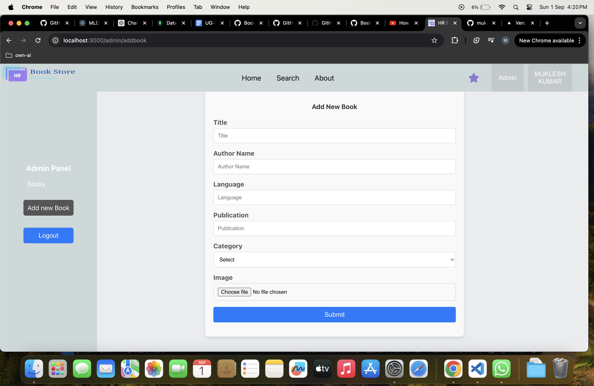
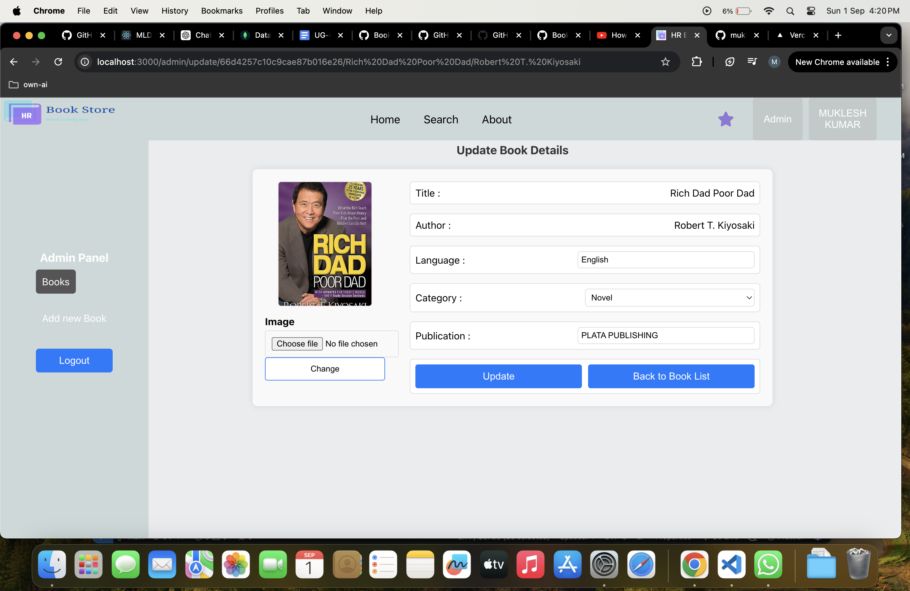
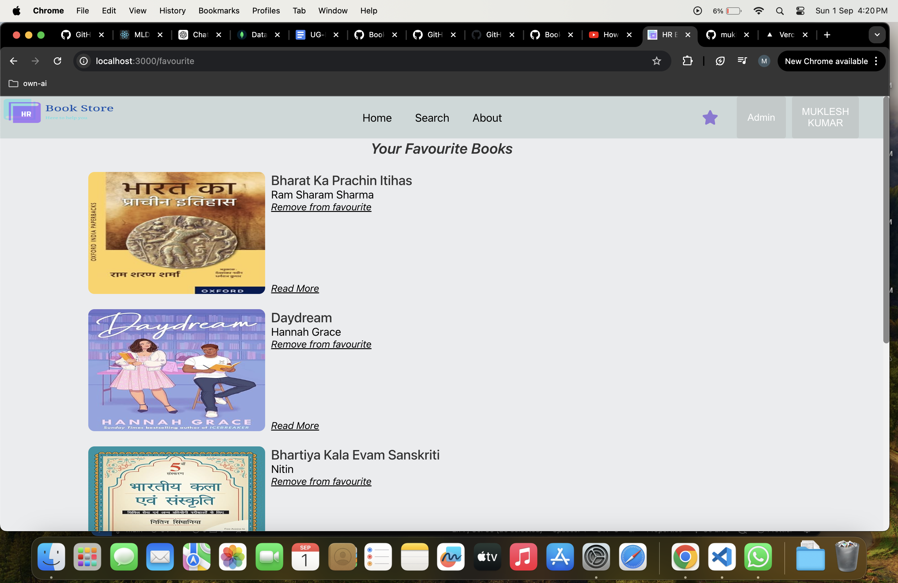
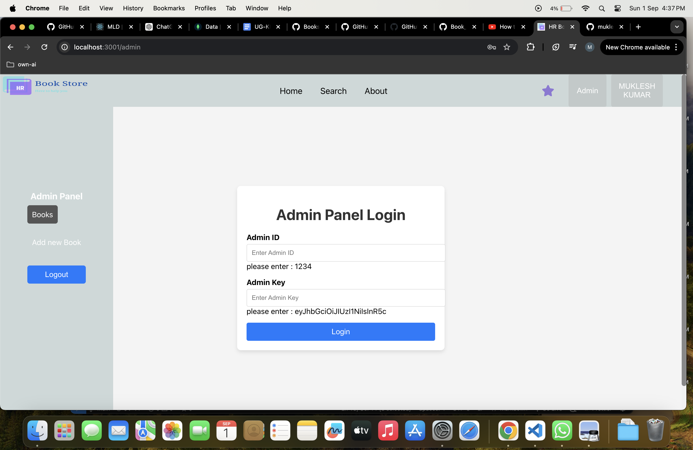

# HR Book Store

Welcome to HR Book Store, a MERN stack project designed to provide a seamless book store experience. This app/website allows users to explore a wide range of books, read reviews, and contribute their own feedback to help fellow readers make informed choices. We are continuously working to enhance this platform by adding new functionalities to improve the overall book store experience.

## Image

## Features

- **Extensive Book Collection**: HR Book Store offers a diverse collection of books from various genres, ensuring there's something for every reader's interest.

- **User Reviews**: Read reviews and ratings provided by other users to gain insights and make informed decisions when selecting your next read.

- **Contribute Your Reviews**: Share your thoughts and opinions about the books you've read to help other users in their book selection process.

- **User-Friendly Interface**: HR Book Store features an intuitive and user-friendly interface, making it easy to navigate, search for books, and access relevant information.

## Technologies Used

HR Book Store is built using the MERN stack, which includes the following technologies:

- MongoDB: A flexible and scalable NoSQL database used to store book and user information.
- Express.js: A web application framework for Node.js, used to build the backend server and handle API requests.
- React: A JavaScript library for building user interfaces, used to create an interactive and dynamic frontend.
- Node.js: A JavaScript runtime environment used to run server-side code and handle backend operations.

## Getting Started

To get started with HR Book Store, follow these steps:

1. Clone the repository.
2. Install the required dependencies by running `npm install` in both the frontend and backend directories.
3. Configure the MongoDB connection string and other environment variables.
4. Start the backend server by running `npm start` in the backend directory.
5. Start the frontend development server by running `npm start` in the client directory.

## Environment Variables

The following environment variables are required to run the HR Book Store application:

- `URL_DB`: The URL or connection string for the MongoDB database.
- `JWT_TOKEN`: The secret key used for JSON Web Token (JWT) generation and verification.
- `API_KEY`: The API key required for accessing certain external APIs.
- `EMAIL`: The email address to be used for sending emails from the application.
- `EMAIL_PASSWORD`: The password associated with the email address.
- `ADMINID`: Admin authentication
- `ADMINKEY`: Admin authentication

## Configuration

To configure the application with the necessary environment variables, follow these steps:

1. Create a new file named `.env` in the root directory of the project.
2. Open the `.env` file in a text editor.
3. Add the required environment variables to the file in the format `VARIABLE_NAME=VALUE`. For example:

---

Experience the world of literature at HR Book Store. Explore our extensive book collection, read and contribute reviews, and immerse yourself in the joy of reading. Together, let's create an exceptional book store experience for all readers.
